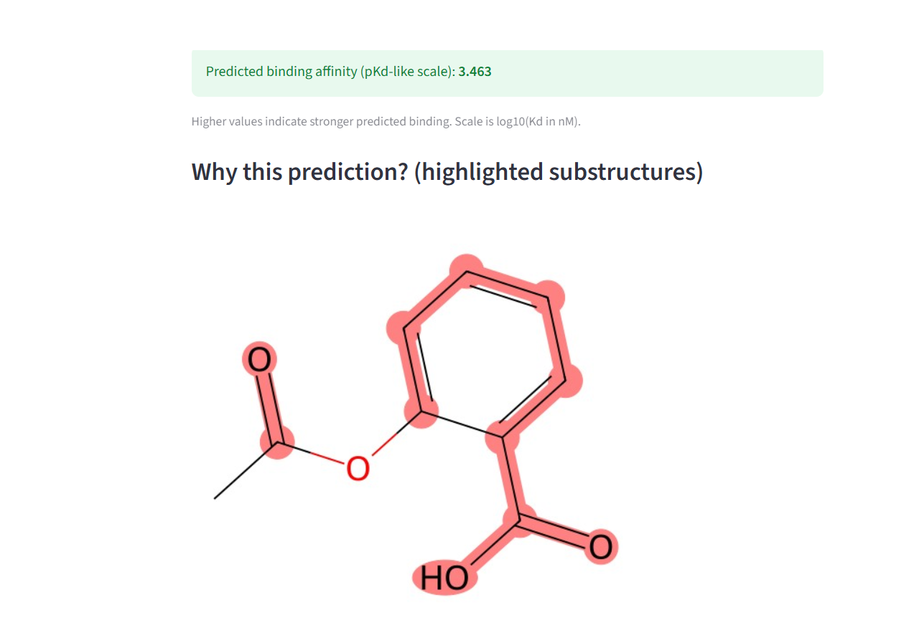

# Drug-Target Binding Affinity Predictor

Predicting how strongly a drug molecule binds to a protein target, using classical ML and graph neural networks — with visual interpretability showing *why* the model made its prediction.

**Live demo:** [drug-target-affinity.streamlit.app](https://drug-target-affinity.streamlit.app)

---

## Problem

Drug discovery involves screening thousands of candidate molecules against protein targets to find strong binders. Wet-lab testing is slow and expensive — computational prediction of binding affinity helps prioritize which candidates to actually test.

This project predicts binding affinity (pKd-like scale) for a given (drug, protein) pair, using the [DAVIS dataset](https://doi.org/10.1038/nbt.1990) — 68 drugs × 442 protein targets, ~30,000 measured binding affinities.

## Key finding

A regularized XGBoost baseline using Morgan fingerprints and protein composition features was evaluated under two conditions:

| Split type | Test R² | What it tells us |
|---|---|---|
| **Random split** | 0.56 | Optimistic — similar molecules can leak between train/test |
| **Scaffold split (cold-drug)** | 0.03 | Realistic — test molecules are structurally novel vs. training set |

A 3-layer Graph Neural Network with frozen ESM-2 protein embeddings was also trained and evaluated under the same scaffold split, for a fair comparison:

| Model | Scaffold-split Test R² |
|---|---|
| XGBoost baseline | **0.03** |
| GNN + ESM-2 | -0.09 |

**Takeaway:** performance collapses dramatically under scaffold splitting for both models — a well-documented, real phenomenon in drug discovery ML, since predicting affinity for genuinely novel chemical scaffolds is a much harder problem than interpolating between similar known molecules. The lightweight GNN (frozen embeddings, ~20K training examples, no fine-tuning) did not outperform the classical baseline here — a legitimate finding, not a bug, and consistent with known low-data limitations of graph-based molecular models. This motivated choosing XGBoost as the production model for the deployed app.

## Interpretability

Rather than treating the model as a black box, predictions are paired with a visual explanation: RDKit substructure highlighting shows which molecular fragments contributed most to a given prediction, based on XGBoost feature importances mapped back to Morgan fingerprint bits.

Example — aspirin, with its acetyl and carboxylic acid groups (its actual reactive functional groups) correctly highlighted as most influential:



## Architecture

```
SMILES string ──► Morgan Fingerprint (2048-bit)  ─┐
                                                    ├──► XGBoost Regressor ──► Predicted pKd
Protein sequence ──► Mono + Dipeptide Composition ─┘

(GNN variant, evaluated for comparison:)
SMILES string ──► Molecular Graph ──► 3-layer GCN ─┐
                                                     ├──► Fusion MLP ──► Predicted pKd
Protein sequence ──► ESM-2 (frozen) Embedding ──────┘
```

## Tech stack

- **Data:** DAVIS dataset (via stable GitHub mirror), RDKit for cheminformatics
- **Classical ML:** XGBoost, scikit-learn
- **Deep learning:** PyTorch, PyTorch Geometric (GCN), Hugging Face Transformers (ESM-2 protein language model)
- **Evaluation:** scaffold/cold-split validation (not just random split) to simulate real-world generalization to novel drugs
- **Deployment:** Streamlit, hosted on Streamlit Community Cloud

## Repository structure

- [`drug-target-affinity-predictor`](https://github.com/SusmithaaSankar/drug-target-affinity-predictor) — full training pipeline: data loading, featurization, baseline training, GNN training, interpretability (Jupyter/Colab notebook)
- [`drug-affinity-app`](https://github.com/SusmithaaSankar/drug-affinity-app) — deployed Streamlit application source

## Running locally

```bash
git clone https://github.com/SusmithaaSankar/drug-affinity-app.git
cd drug-affinity-app
pip install -r requirements.txt
streamlit run app.py
```

## What I'd improve with more time

- Fine-tune ESM-2's later layers instead of using frozen embeddings, to give the GNN a fairer shot at outperforming the baseline
- Train on the larger, combined DAVIS + KIBA + BindingDB datasets for more scaffold diversity
- Add GNNExplainer for atom-level interpretability directly on the graph model, not just the fingerprint-based baseline
- Add confidence intervals / uncertainty estimates to predictions, since a single point estimate understates real-world risk in a drug discovery context

## Author

Built as a self-directed project applying ML to computational drug discovery. Full development process — including real debugging of environment issues, a corrupted-embedding bug, and an honest negative result — documented in the training notebook's commit history.
